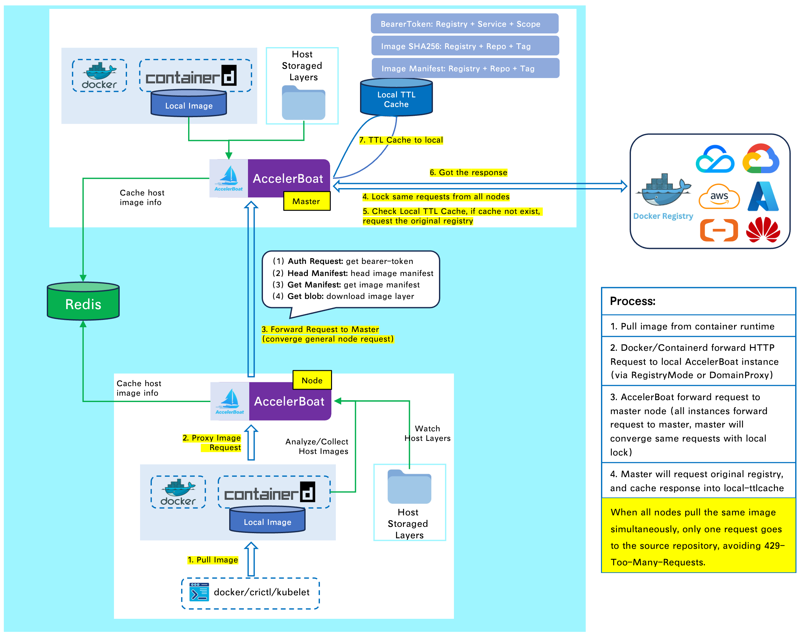

# accelerboat


---

AccelerBoat 是一个 OCI 镜像加速器，可以加速整个局域网内的镜像拉取，并收敛中心 Registry 仓库的拉取流量。

## 适用场景

**场景一**：大规模集群拉取镜像缓慢，进行速度提升

**场景二**：跨大洲/地域/网络拉取某个中心 Registry 仓库速度缓慢，节省跨公网带宽流量成本

**场景三**：跨大洲拉取中心 Registry 面临黑/白名单加白问题，提供统一拉取流量出口能力

**场景四**：跨大洲用户使用多个镜像仓库，希望配置多个用户名/密码，通过 CNAME 实现就近拉取

**场景五**：复用集群内其它节点上已经存在的 OCI 镜像

> 注：镜像加速是为了做镜像拉取的速度加快，并不能代替国内到海外公网 Registry 网络的加速

## 架构概述

参考 [基础架构与原理](./docs/0-architecture_zh.md) 获取 AccelerBoat 的详细实现



## 入门使用

### 如何安装
Add custom helm repo to local, and pull chart of AccelerBoat

```bash
helm repo add accelerboat https://penglongli.github.io/accelerboat
helm pull accelerboat/accelerboat
```

