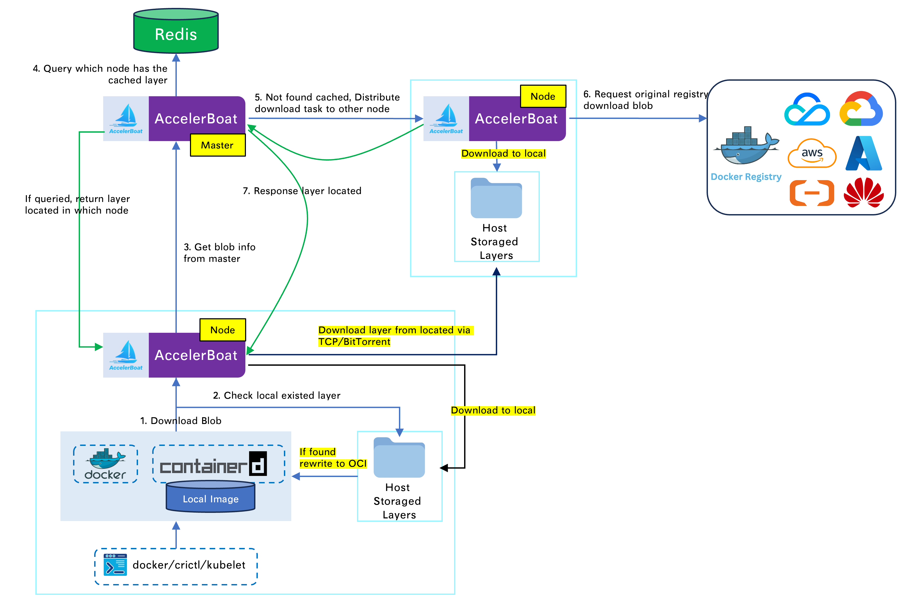
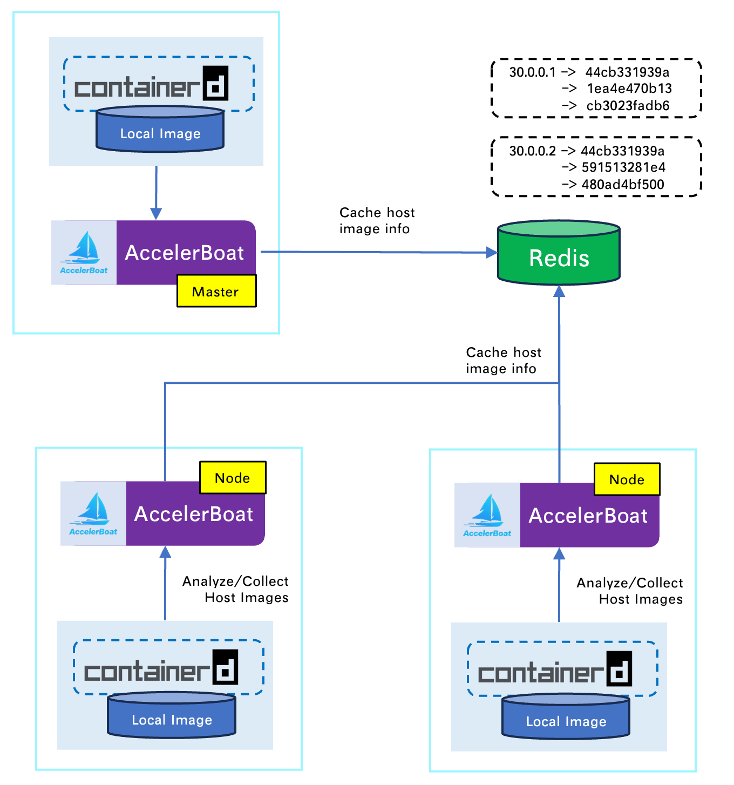
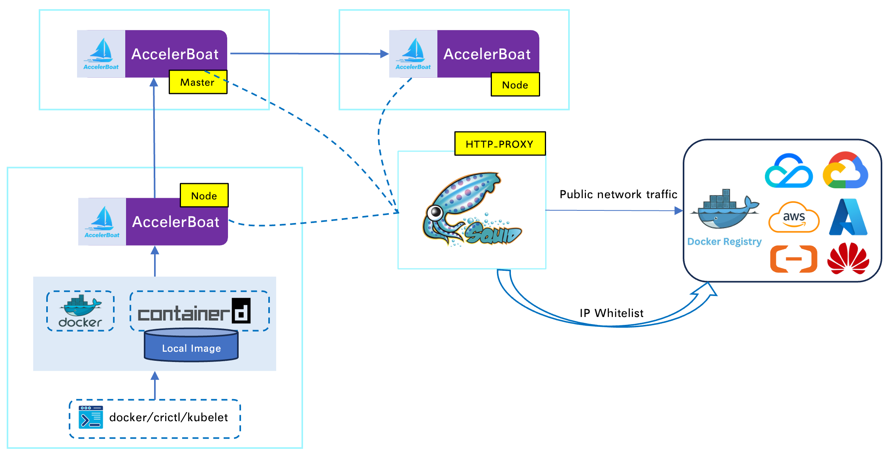
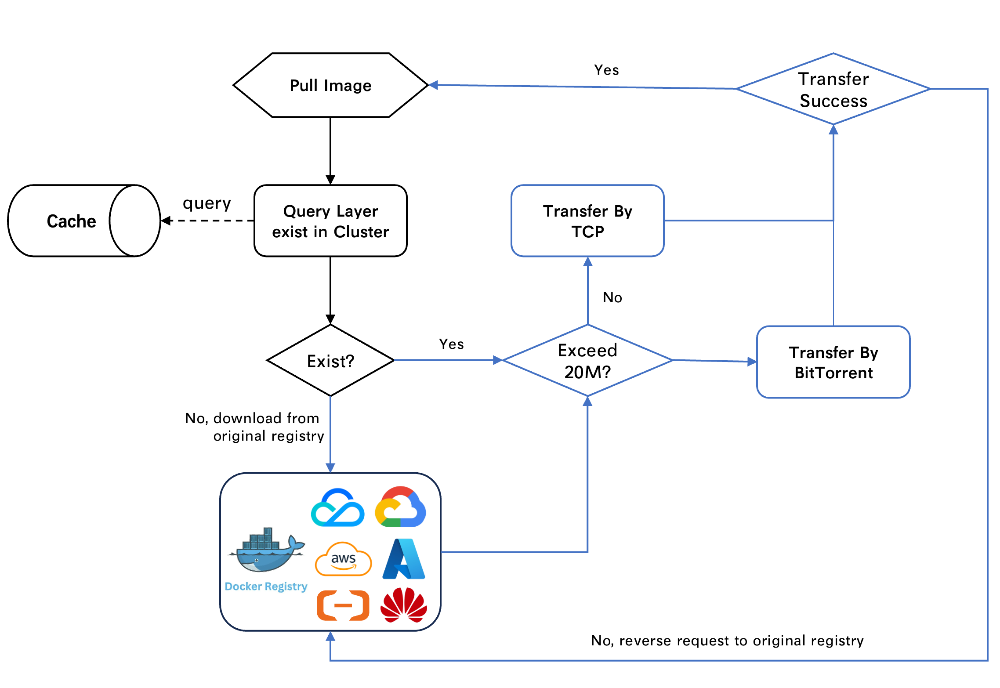

# AccelerBoat: Principles and Architecture

## Overview

**AccelerBoat** is an OCI image registry accelerator for Kubernetes and LAN environments. It reduces load on the central registry by consolidating requests (traffic) and distributing traffic within the LAN via TCP/BitTorrent.

### Capabilities

- **Image discovery**: Each node discovers available OCI images and analyzes image layers. If a node already has an image, it does not need to pull from the central registry.
- **Traffic consolidation**: A Master node handles Auth, Manifest, and DownloadBlob requests centrally, reducing duplicate requests to the central registry and avoiding 429 Too-Many-Requests errors.
- **Image acceleration**: Uses TCP/BitTorrent for faster image distribution within the LAN.
- **Unified egress**: All nodes access the upstream registry through a single proxy (HTTP_PROXY), suitable for fixed-IP whitelist scenarios.
- **Multi-account support**: One proxy domain can serve multiple username/password pairs for the same registry (e.g., one proxy domain with different credentials for different registries).

## Architecture

AccelerBoat runs as an HTTP/HTTPS service, typically deployed with multiple replicas in Kubernetes. It acts as a proxy in front of the registry and supports clients (Docker, Containerd, etc.) using the Registry V2 protocol to pull images.

Two deployment modes are supported:

1. **RegistryMirror**: Configure mirrors in Docker/Containerd (e.g. `http://localhost:2080`) and restart the runtime.
2. **DomainProxy**: Configure an image proxy domain and the original registry domain in config:
   - Add a custom domain pointing to 127.0.0.1 (e.g. `accelerboat.image-proxy.com`).
   - Obtain TLS cert/key for that domain.
   - Set the upstream registry domain (e.g. Tencent Cloud TCR: `test-tcr.tencentcloudcr.com`).

The first approach requires changing host-level Containerd/Docker config. The second is generally preferred. Example configuration:

```yaml
registryMappings:
- enable: true
  originalHost: "test-tcr.tencentcloudcr.com"
  proxyHost: "accelerboat.image-proxy.com"
  proxyCert: "Base64(TLS-Cert)"
  proxyKey: "Base64(TLS-Key)"
```

### Request Flow

When a client pulls an image, the request is sent to the local AccelerBoat instance. AccelerBoat resolves the upstream registry from the request Host, then classifies and handles the request.


#### Request Classification (per node)

Requests are classified by URL path and HTTP method:

- **Service Token**: `GET /service/token?service=...&scope=...` — obtain OAuth2 token for the registry.
- **Head Manifest**: `HEAD /v2/<repo>/manifests/<tag>` — get image digest and headers.
- **Get Manifest**: `GET /v2/<repo>/manifests/<tag>` — get manifest JSON.
- **Get Blob**: `GET /v2/<repo>/blobs/sha256:<digest>` — download a single layer.

After classification, these requests are forwarded to the Master for handling. All other requests are proxied directly to the upstream registry.

#### Master Handling

The Master exposes `/customapi` to handle requests forwarded from each AccelerBoat instance.

**1. Service Token**

- If a cached token exists (cache key: `originalHost` + `service` + `scope`), return it.
- Otherwise request a token from the upstream registry (optionally with client `Authorization`).
- If **multi-user** is configured (`RegistryMapping.Users`), on first failure or when the client did not send auth, retry with each configured username/password in order.
- On success, cache the token (e.g. 10s) and return it.

**2. Head Manifest / Get Manifest**

- The Master requests the **upstream registry** (with client auth headers), caches the result briefly (e.g. 10 seconds), then returns headers or manifest body to the proxy.
- **Effect**: Manifest traffic is consolidated and cached on the Master, reducing repeated calls to the upstream registry.

**3. Get Blob (layer download)**

Layer download logic is more involved; see [Image Layer Download](#image-layer-download) below.

### Image Layer Download

This is the core of image acceleration:

1. When an AccelerBoat instance receives a GetBlob request, it first checks for a **local layer cache**.
   - If present, it serves the layer directly (rewrite to OCI layer).
2. If not found locally, the instance sends `/customapi/get-layer-info` to the Master to resolve the layer.
   - The Master queries Redis for that layer:
     - **Static layers**: layer files already on disk on various nodes.
     - **OCI layers**: layers present in Containerd on nodes.
   - Layers found in Redis are validated; if valid, the result is returned.
3. If the layer is not found in Redis (no node in the LAN has it):
   - The Master assigns the layer download to an idle node.
   - That node downloads the layer, then reports “Layer Located” to the Master.
4. The Master returns layer location info to the client’s AccelerBoat instance, which then downloads the layer from within the LAN.



### Image Discovery

Image discovery is inspired by [spegel](https://github.com/spegel-org/spegel).

AccelerBoat uses Containerd’s OCI APIs to read stored **OCI Image** metadata and caches each node’s information in Redis.

When the Master receives a layer download request, it looks up Redis to see if any node in the cluster already has that layer. If so, it does not pull from the upstream registry.



### Unified Egress

- In restricted networks, the upstream registry may only allow a **fixed IP whitelist**.
- AccelerBoat can be configured with an **HTTP proxy** (`ExternalConfig.HTTPProxyUrl`). All outbound requests to the **upstream registry** (token, manifest, layer) go through this proxy.
- If all replicas use the same proxy, from the registry’s perspective **all** pull traffic comes from that proxy’s egress IP; only that IP needs to be whitelisted.



### Single Proxy Host, Multiple Credentials

- One proxy host (e.g. `proxy.example.com`) can map to **one** upstream registry but support **multiple** accounts.
- **Users** (username + password list) can be configured in the registry mapping.
- When the Master fetches a **Service Token**, if the client’s auth fails or is missing, it retries with each configured **Users** entry until one succeeds; that token is cached and returned.
- Thus one domain can serve multiple registry identities (e.g. different regions or teams) without the client needing to know which credentials are used; the server picks an available account automatically.

## High Availability

Image pulls use **tiered transfer** rules. BitTorrent can significantly speed up transfer but uses more CPU/memory, so layer size is used to choose the protocol:

- Layers **larger than 20 MB**: transfer within the LAN uses **TCP**.
- Layers **larger than 10 MB**: transfer uses **P2P Torrent** within the LAN.

Transfer is monitored. If something goes wrong (e.g. source layer deleted, transfer interrupted, or no progress), the system falls back to the upstream registry to download the layer, aiming for **100% pull success**.


