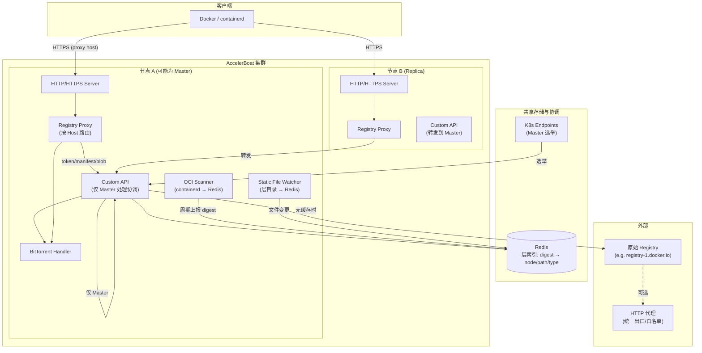
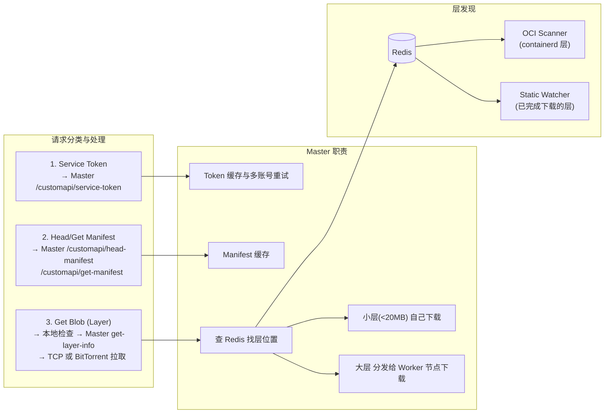
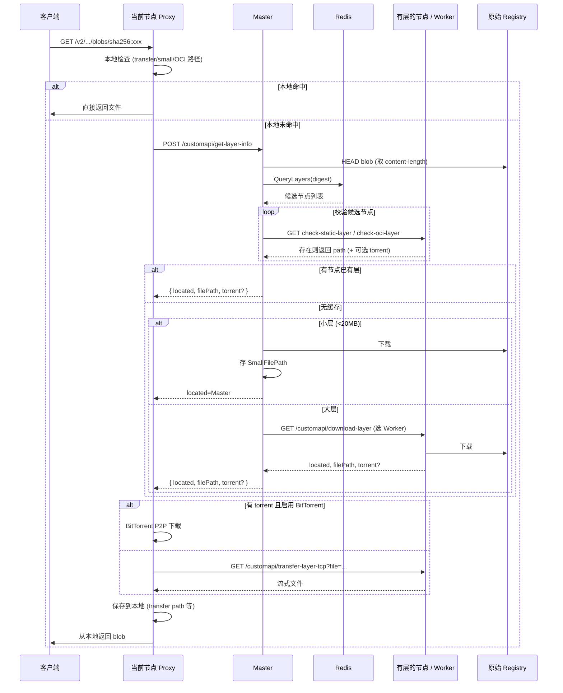
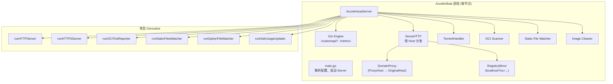

# AccelerBoat 架构图

## 系统概览

AccelerBoat 是 OCI 镜像仓库加速器，作为 **Registry 代理** 运行：客户端（Docker/containerd）将 registry 配置指向代理地址，代理拦截 OCI 请求并从本地或集群内缓存提供服务，必要时回源到上游仓库。

---

## 高层架构图（Mermaid）

---

## 请求流与组件关系图

---

## 单次 Blob (Layer) 下载流程

---

## 部署与进程内组件

---

## 数据与路径

| 存储/路径         | 用途 |
|------------------|------|
| **Redis**        | 层索引：digest → (node, path, type, ts)。OCI 层、静态层均上报至此。 |
| **TransferPath** | 已完成下载的层（TCP 拉取），可被 Static Watcher 发现并写入 Redis。 |
| **DownloadPath** | 临时下载目录，不保证完整。 |
| **SmallFilePath**| 小层（如 <20MB）由 Master 下载存放。 |
| **TorrentPath**  | BitTorrent 缓存与种子存储。 |
| **OCIPath**      | 从 containerd 导出的层缓存。 |

---

## 小结

- **入口**：HTTP/HTTPS 按 Host 区分代理类型（DomainProxy / RegistryMirror），请求进入 Registry Proxy。
- **协调**：仅 **Master** 处理 Custom API 中的 token、manifest、get-layer-info 及下载分发；Master 通过 **K8s Endpoints** 选举（可配 masterIP 或 prefer nodes）。
- **发现**：**Redis** 存层位置；**OCI Scanner** 周期扫描 containerd 上报；**Static File Watcher** 监听层目录变更上报。
- **加速**：层优先从本地或集群内节点取（TCP 或 BitTorrent）；无缓存时由 Master 或指定 Worker 从原始 Registry 拉取，并支持 **HTTP 代理** 统一出口。
- **多账号**：同一 Proxy Host 可配置多组用户名/密码，Master 在取 token 时按序重试并缓存。

以上图与表格可从 `docs/architecture-diagram.md` 查看与编辑；在支持 Mermaid 的 Markdown 预览（如 VS Code、GitHub）中可直接渲染为图。
